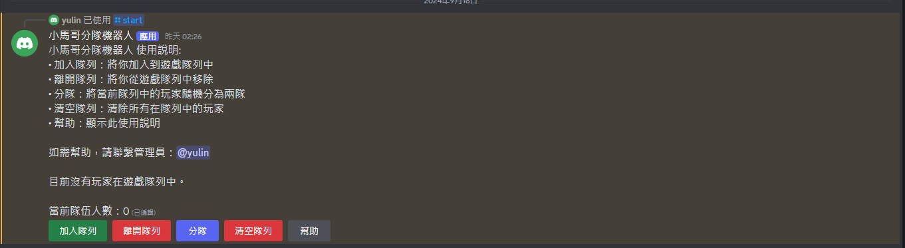

# 分隊機器人

## 功能
將聊天室內的成員分為兩隊

## 指令說明
- `/start`: 開始使用機器人
- `/kick @membername`: 從對列中剔除某位成員
- 其他指令(使用按鈕)
  


## 1. 準備環境

- 進入專案資料夾

- 建立虛擬環境

  - Anaconda
    ```bash
    conda create --name divide_team_bot python
    conda activate divide_team_bot
    ```

  - venv
    ```bash
    python -m venv divide_team_bot
    divide_team_bot\Scripts\activate
    ```

- 安裝依賴套件
  ```bash
  pip install -r requirements.txt
  ```

## 2. 創建環境變數檔案:
- 前往 [Discord Developers](https://discord.com/developers/applications) 創建機器人([參考文章](https://hackmd.io/@smallshawn95/python_discord_bot_base))
- 在同一資料夾中創建一個名為 `.env` 的檔案
- 在 `.env` 檔案中添加以下內容：
    ```
    CopyDISCORD_BOT_TOKEN=你的機器人令牌
    ADMIN_ID=你的 Discord 用戶開發者 ID
    ```

- 將 "你的機器人令牌" 替換為你從 Discord Developer Portal 獲得的實際令牌
- 將 "你的 Discord 用戶 ID" 替換為你的實際 Discord 用戶開發者 ID

## 3. 直接執行或設定自動啟動

### 直接執行

#### 1. 於終端機執行

```
python divide_team_bot.py
```

#### 2. 使用 screen 或 tmux（適用於 Linux 或 macOS）

##### 使用 screen

1. 安裝 screen（如果尚未安裝）：
   - 在 Ubuntu 或 Debian 上：`sudo apt-get install screen`
   - 在 macOS 上（使用 Homebrew）：`brew install screen`

2. 創建一個新的 screen 會話：
   ```
   screen -S discord-bot
   ```

3. 在 screen 會話中運行您的機器人：
   ```
   python divide_team_bot.py
   ```

4. 分離 screen 會話：按 `Ctrl+A`，然後按 `D`

5. 重新連接到 screen 會話：
   ```
   screen -r discord-bot
   ```

6. 列出所有 screen 會話：
   ```
   screen -ls
   ```

##### 使用 tmux

1. 安裝 tmux（如果尚未安裝）：
   - 在 Ubuntu 或 Debian 上：`sudo apt-get install tmux`
   - 在 macOS 上（使用 Homebrew）：`brew install tmux`

2. 創建一個新的 tmux 會話：
   ```
   tmux new -s discord-bot
   ```

3. 在 tmux 會話中運行您的機器人：
   ```
   python divide_team_bot.py
   ```

4. 分離 tmux 會話：按 `Ctrl+B`，然後按 `D`

5. 重新連接到 tmux 會話：
   ```
   tmux attach -t discord-bot
   ```

6. 列出所有 tmux 會話：
   ```
   tmux ls
   ```

注意：screen 和 tmux 都允許您在關閉終端後保持程序運行，並且可以在需要時重新連接。

### 設置自動啟動

#### Linux (創建一個系統服務)

1. 創建一個服務文件：
   ```
   sudo nano /etc/systemd/system/discord-bot.service
   ```

2. 在文件中添加以下內容（根據您的實際路徑進行調整）：
   ```
   [Unit]
   Description=Discord Bot
   After=network.target

   [Service]
   ExecStart=/usr/bin/python3 /path/to/your/bot.py
   Restart=always
   User=your_username

   [Install]
   WantedBy=multi-user.target
   ```

3. 保存並關閉文件（在 nano 中，按 `Ctrl+X`，然後 `Y`，然後 `Enter`）

4. 重新加載 systemd 管理器配置：
   ```
   sudo systemctl daemon-reload
   ```

5. 啟用服務，使其在系統啟動時自動啟動：
   ```
   sudo systemctl enable discord-bot
   ```

6. 啟動服務：
   ```
   sudo systemctl start discord-bot
   ```

7. 檢查服務狀態：
   ```
   sudo systemctl status discord-bot
   ```

使用系統服務可以確保您的機器人在系統重啟後自動啟動，並在崩潰時自動重啟。

#### Windows (使用任務調度器)

1. 打開工作排程器:
   - 按 `Win + R`，輸入 `taskschd.msc`，按 Enter
  
2. 創建新任務:
   - 在右側面板中點擊 "創建任務..."
   - 在 "一般" 選項卡:
     - 名稱：輸入 "Discord Divide Team Bot"
     - 選擇 "不管使用者是否登入都要執行"
     - 選擇 "使用最高權限執行"
   - 在 "觸發程序" 選項卡:
     - 點擊 "新增"
     - 選擇 "啟動時"，點擊 "確定"
   - 在 "動作" 選項卡:
     - 點擊 "新增"
     - 動作：選擇 "啟動程式"
     - 程式或指令碼：依照虛擬環境選擇 `start_bot_conda.bat` 或 `start_bot_venv.bat` 檔案
   - 在 "設定" 選項卡:
     - 勾選 "允許工作按需執行"
     - 點擊 "確定" 保存任務
3. 立刻執行任務:
   - 在 "觸發程序" 選項卡:
     - 點擊 "新增"
     - 選擇 "依排程執行"
     - 選擇 "僅一次"
     - 點擊 "確定"